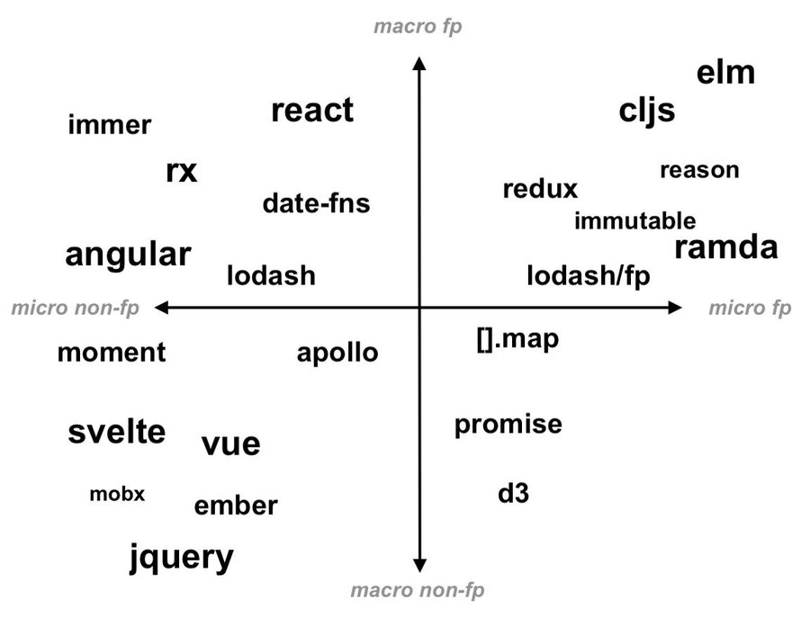

# react-best-practices
A Take On React Best Practices

- Created with https://obsidian.md/
- See [[react-best-practices]]

*A Take On React Best Practices* is a high level overview of React and its ecosystem, and a set of best practices distilled from years of experience.

The target audience is developers with or without React knowledge, and team leaders, project managers ready to familiarize with the big picture. 

A priori web experience might help but often times it's an impediment. 

React is a new take on web and app development both in technology and workflow. It requires a new mindset for all participants in a project.

The next chapters will teach you:

- React is part of the functional and reactive programming paradigm.
- React comes with an ecosystem which is again functional and reactive.
- There are ways to write React apps and there is the quasi-official *Facebook way* serving as best practice.

More, you'll become familiar with concepts like:

- GraphQL and Relay, the *Facebook stack* to create data-driven applications.
- Single Responsibility Principle, the driving force behind the scene.
- UI before API, a new workflow and organizational structure tailored to React.

At the end you'll be able to put React in context with:

- Event-driven architecture
- Domain-driven design
- Design systems

And get some trips and tricks like:

- Formal verification, a new way of testing.
- AWS AppSync, the best React infrastructure provider today.
- Open source packages, a set of curated and tested React accessories.

# React. A short history

React is the most popular web framework today[^1].  

Created by Facebook in 2013 the ecosystem grew mature in 2019. That year the facebook.com redesign and rewrite stack of choice became React, GraphQL and Relay[^2].

Strong support from a major player drove the attention of web and Javascript developers already familiar with another frameworks.

Devs flocking to React often found the learning curve steep[^3] -- due to the fact React brings more novelty to the table than other emerging frameworks like Vue, Svelte. 

It's a new programming, and information architecture paradigm unused before on the web.

Learning React means learning type-safety; functional and reactive programming; data-driven applications; and event-driven architectures.

And as they say, forgetting a priori knowledge about web development may greatly help along the process.

## Footnotes
[^1]: [The State of JavaScript Survey 2019](https://2019.stateofjs.com/front-end-frameworks/)
[^2]: [Building the New facebook.com with React, GraphQL and Relay](https://developers.facebook.com/videos/2019/building-the-new-facebookcom-with-react-graphql-and-relay/)
[^3]: [How to learn React.js in 2020](https://www.robinwieruch.de/learn-react-js)
[^4]: [A Big Picture](http://metamn.io/react/a-big-picture/)

# Prerequisites

React is suitable for everyone because it's a completely novel approach to web development.

If one already knows HTML, CSS it might help, but it doesn't offer an outstanding advantage. Components and design systems hide these abstractions and incorporate the necessary knowledge to build the front-end. 

Programming experience helps only if it's functional. In React no one writes complex algorithms; instead manipulates the data flow using functional programming concepts.

The knowledge of older paradigms like MVC, REST and CRUD doesn't helps either. The React ecosystem -- GraphQL and Relay -- sports concepts unseen previously in web frameworks.

# The Facebook stack

React is one piece of the puzzle.

Facebook decided a decade ago to rethink their approach to web development and infrastructure[^1] . During the process they threw out everything old and replaced:

- Imperative programming with functional and reactive programming
- DOM with the shadow DOM
- HTML, CSS and Javascript with web components and design systems
- Client-server architecture with Event-driven architecture
- REST APIs with GraphQL APIs
- Don't Repeat Yourself (DRY) with the **Single Responsibility Principle (SRP)**

With the new stack:

- Devs *declare* the app functionality instead of writing sophisticated algorithms.
- Devs *declare* their data needs on the front-end instead of getting it from the back-end.
- Devs *declare* the app style using design systems instead of writing HTML and CSS by hand.
- The ecosystem, GraphQL and Relay, handles all else in the background. Collects all data a page needs into a single call to the backend -- for example.

Making one's mind to embrace this new stack is not always trivial. Learning React should follow the small steps:

1. Learn functional and reactive programming. 
2. Understand and adhere to Thinking in React.
3. Try React in a classic REST API environment.
4. Move to GraphQL with a non-Relay server like Apollo.
5. Switch to the complete Facebook stack with Relay.
6. Understand type safety; data-driven applications; and event-driven architectures.

With plenty of will, time and courage an exciting new ecosystem will unfold. Where all parts are important, made to fit and work together. 

## Footnotes
[^1]: [We're gonna program like it's 1999](http://metamn.io/react/were-gonna-program-like-its-1999/)

# The Facebook way

React is an unopinionated framework.

Apps written in React vary in coding style from developer to developer, company to company.

As always, is best to follow the creators.

Facebook, the creator of React, published Thinking in React[^1] -- a set of guidelines "to think about apps as you build them" or  "the thought process of building with React".

Omitting these guidelines is reinventing the wheel. Chances are slim to come up with a better solution. Unless one masters better resources than Facebook.

Practicing Thinking in React surfaces, after a while, the following advantages: 

- Decision making becomes easy. 
- Code written by a team looks like code written by a single person.
- Re-usable components and business logic grows from project to project becoming wealth.

## Footnotes
[^1]: [Thinking in React](https://reactjs.org/docs/thinking-in-react.html)

# Thinking in React

Thinking in React[^1] is Facebook's opinion on how "to build big, fast Web apps with JavaScript."

The knowledge distilled here comes from building their own Facebook and Instagram products. 

At the top of the document they rush to state React has a special way to think about app development. It's a different thought process than the previous attempts.

## Start with a  Mock

In *What Are React Principles?*[^2] Dan Abramov, React core-member and developer advocate starts with: UI before API.

Now that's a new approach. Before React the thought process was:

1. The UI/UX design team creates mockups and wireframes.
2. The back-end team creates the API.
3. The front-end team merges the two together. 

Facebook realised the drawbacks of this approach. What the users see -- the app -- is the result of a complicated merging process across departments, done at the end.

Instead, they said, let's start with front-end then connect everything else to it.  UI before API.

In Thinking in React front-end developers are in power. They mock up the application.

### Single Responsibility Principle (SRP)

New principles build new paradigms. 

A decade ago Ruby on Rails made MVC, REST and CRUD mainstream together with the **Don't Repeat Yourself (DRY)** principle.

Now Facebook introduces another principle, SRP, to the web. The concept is not new, is part of the UNIX philosophy: do one thing and do it well.

Thinking in React says breaking up the UI into components should follow this principle of simplicity. 

"A component should ideally only do one thing. If it ends up growing, it should be decomposed into smaller subcomponents. 

Once mastered this principle drives all decisions during a React project. From front-end down the whole stack and process.

## Build a static version first

The mocking process assures all stakeholders about the common understanding of the business requirements. And offers the first proof of concept the app will follow the specifications.

Next, Thinking in React says, let's wire in data. Let's repeat the success of the previous UI mocking process now on a level up.

Static data means no back-end work involved yet. Front-end tools are capable to generate text, images, and content necessary to give a glimpse how the final app will look.

The end of this phase marks a milestone. The app works infantly yet visibly leaving no doubts about its feasibility.

## Add interactivity

The dynamic version of the app brings technological advancements to the project.

This phase defines the data needs of the front-end. Back-end is now ready to start the implementation. 

The UI/UX design team is ready to take the live, responsive prototype and apply the branding.

Different teams enter the project and kept in sync by front-end who gradually integrates the advancements and offers a single source of truth. 

## Summary

Thinking in React is a process well-tested to build large scale applications. 

Introduces a new principle to web development and shifts control to the front-end.

The steps gradually assure stakeholders about the future success of the product.

## Footnotes
[^1]: [Thinking in React](https://reactjs.org/docs/thinking-in-react.html) 
[^2]: [What Are the React Team Principles?](https://overreacted.io/what-are-the-react-team-principles/)

# Functional and reactive programming

React follows the functional reactive programming paradigm[^1]. That’s a shift from the old proactive, imperative approach.

Both paradigms solve the same problem in different ways: build *modular*, *interactive* applications.

The old way implemented modularity through tight-coupling, and interaction synchronously. The new way implements modularity with loose-coupling, and interaction asynchronously.

To clear the picture let's abstract modularity and interaction to *composition* and *coupling*.

Composition is about how the components of the system can add up to form a whole, while coupling is about how they communicate with each other.

## Composition (Functional programming)

Composing up a system from smaller parts is best possible when the underlying components behave predictably. 

In functional programming terms they are *pure*:

1. Provide clear and stable interfaces — input parameters and return values — to ease combinations.
2. Process input parameters into return values in a clean way:
	1. Avoid modification of input parameters.
	2. Avoid adding external information. Input parameters are enough to produce the return value. 
	3. Avoid adding external operations. The algorithm does the transformation and that's all.

Pure functions and components alone cannot build a complex system. Impurity -- non-pure with *side effects* -- is the rescue.

Side effects need special attention to keep components resilient, to keep data and interactions flowing seamlessly through the component hierarchy during page rendering[^2].

## Coupling (Reactive programming)

Coupling means communication between the components of a system. 

To make a system scalable, communication has to be as effective as composition.

Reactive programming achieves this through:

1. The Single Responsibility Principle, where components:
	1. Are aware of, and care about their own problems solely.
	2. Does not interfere with the internals of other components.
2. Asynchronous, event-based communication where components:
	1. Subscribe to events.
	2. React when an event happens.
	3. Return an observable — which emits events other components can subscribe to.

## Summary

React's props, hooks and JSX resemble functional reactive programming principles.

Props are immutable; hooks manage the side-effects; JSX is an observable.

*Fig.1 React as a functional reactive architecture*

Put on a map React sits between Angular and Elm.

*Fig.2 The functional programming alignment map [^3]*

## Footnotes
[^1]: [An Introduction to Functional Reactive Programming](https://blog.danlew.net/2017/07/27/an-introduction-to-functional-reactive-programming/)
[^2]: [Writing Resilient Components](https://overreacted.io/writing-resilient-components/#writing-resilient-components)
[^3]:[The functional programming alignment map by Dan Abramov](https://twitter.com/dan_abramov/status/1286844305575944193)

