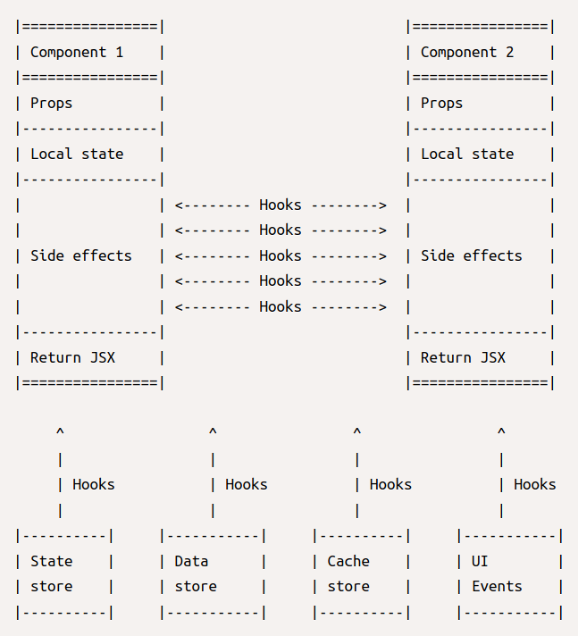

# Functional and reactive programming

React follows the functional reactive programming paradigm[^1]. That’s a shift from the old proactive, imperative approach.

Both paradigms solve the same problem in different ways: build *modular*, *interactive* applications.

The old way implemented modularity through tight-coupling, and interaction synchronously. The new way implements modularity with loose-coupling, and interaction asynchronously.

To clear the picture let's abstract modularity and interaction to *composition* and *coupling*.

Composition is about how the components of the system can add up to form a whole, while coupling is about how they communicate with each other.

## Composition (Functional programming)

Composing up a system from smaller parts is best possible when the underlying components behave predictably. 

In functional programming terms they are *pure*:

1. Provide clear and stable interfaces — input parameters and return values — to ease combinations.
2. Process input parameters into return values in a clean way:
	1. Avoid modification of input parameters.
	2. Avoid adding external information. Input parameters are enough to produce the return value. 
	3. Avoid adding external operations. The algorithm does the transformation and that's all.

Pure functions and components alone cannot build a complex system. Impurity -- non-pure with *side effects* -- is the rescue.

Side effects need special attention to keep components resilient, to keep data and interactions flowing seamlessly through the component hierarchy during page rendering[^2].

## Coupling (Reactive programming)

Coupling means communication between the components of a system. 

To make a system scalable, communication has to be as effective as composition.

Reactive programming achieves this through:

1. The Single Responsibility Principle, where components:
	1. Are aware of, and care about their own problems solely.
	2. Does not interfere with the internals of other components.
2. Asynchronous, event-based communication where components:
	1. Subscribe to events.
	2. React when an event happens.
	3. Return an observable — which emits events other components can subscribe to.

## Summary

React's props, hooks and JSX are implementing functional reactive programming principles.

Props are immutable; hooks manage the side-effects; JSX is an observable.

*Fig.1 React as a functional reactive architecture*

## Footnotes
[^1]: [An Introduction to Functional Reactive Programming](https://blog.danlew.net/2017/07/27/an-introduction-to-functional-reactive-programming/)
[^2]: [Writing Resilient Components](https://overreacted.io/writing-resilient-components/#writing-resilient-components)

## Resources
1. [The original article](http://metamn.io/react/the-reactive-fuctional-nature-of-react/)